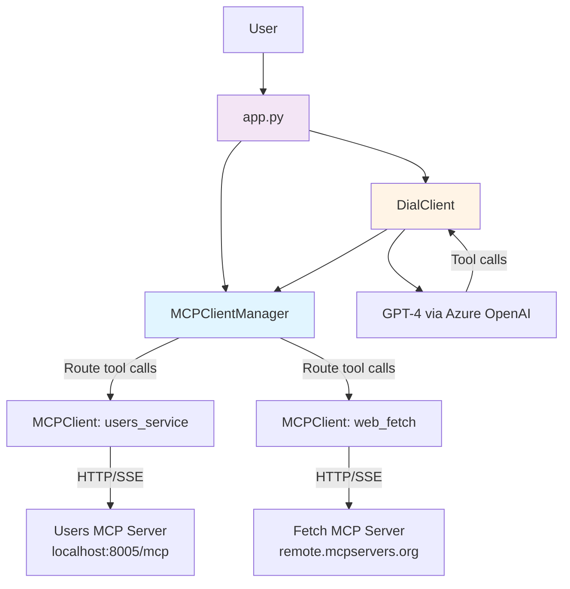
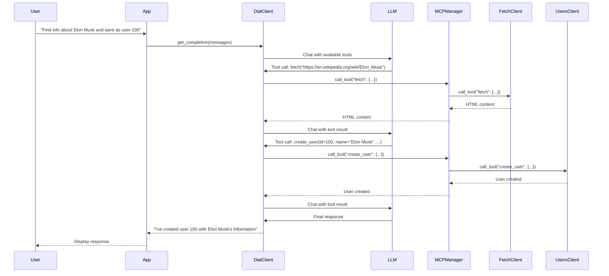

# Agent Architecture - Multi-MCP Server Support

## Overview

This agent is designed to work with **multiple MCP (Model Context Protocol) servers simultaneously**, enabling it to combine capabilities from different services. The key architectural principle is maintaining **1-to-1 connections** between MCP clients and MCP servers, with intelligent routing of tool calls.

## Architecture Diagram



## Core Components

### 1. **MCPClientManager** (`mcp_client_manager.py`)

**Purpose**: Manages multiple MCP clients and routes tool calls to the appropriate server.

**Key Features**:
- Maintains a registry of MCP clients by name (e.g., "users_service", "web_fetch")
- Maps tool names to their respective MCP clients
- Routes tool calls to the correct MCP server based on tool name
- Aggregates resources and prompts from all connected servers
- Handles graceful shutdown of all connections

**Key Methods**:
```python
await add_mcp_client(client_name, mcp_server_url)  # Connect to a new MCP server
await get_all_tools()                               # Get tools from all servers
await call_tool(tool_name, tool_args)              # Route tool call to correct server
await get_all_resources()                           # Get resources from all servers
await get_all_prompts()                             # Get prompts from all servers
await close_all()                                   # Close all connections
```

**Tool Registry Example**:
```python
{
    "get_user": "users_service",
    "create_user": "users_service",
    "fetch": "web_fetch",
    "search": "web_fetch"
}
```

### 2. **MCPClient** (`mcp_client.py`)

**Purpose**: Handles connection to a single MCP server using HTTP/SSE streaming.

**Key Features**:
- Establishes and maintains connection to one MCP server
- Provides methods to list and call tools, resources, and prompts
- Uses `streamablehttp_client` for bidirectional communication
- Handles async context management for clean connection lifecycle

**Connection Flow**:
1. Create `streamablehttp_client` connection
2. Establish `ClientSession` with read/write streams
3. Initialize the session with the MCP server
4. Ready to execute MCP protocol operations

### 3. **DialClient** (`dial_client.py`)

**Purpose**: Orchestrates AI model interactions and tool execution.

**Key Features**:
- Interfaces with Azure OpenAI (GPT-4) for LLM capabilities
- Streams responses to provide real-time feedback
- Detects when LLM wants to use tools
- Delegates tool execution to `MCPClientManager`
- Implements recursive tool calling loop (agent loop)

**Agent Loop**:
```
1. Send messages to LLM
2. LLM responds with tool calls
3. Execute tools via MCPClientManager
4. Append tool results to messages
5. Recursively call LLM with updated messages
6. Repeat until LLM provides final answer
```

### 4. **Application** (`app.py`)

**Purpose**: Main entry point that orchestrates the entire system.

**Initialization Flow**:
```python
1. Create MCPClientManager
2. Connect to Users Service MCP Server
3. Connect to Web Fetch MCP Server
4. Collect all tools from all servers
5. Create DialClient with all tools
6. Load prompts from all servers
7. Start interactive chat loop
8. Clean up all connections on exit
```

## Data Flow

### Example: "Find info about Elon Musk and save as user 100"



## Key Design Principles

### 1. **1-to-1 MCP Client-Server Relationship**
Each `MCPClient` maintains a dedicated connection to exactly one MCP server. This ensures:
- Clean connection management
- No cross-contamination of contexts
- Clear ownership of resources and tools

### 2. **Tool Registry Pattern**
The `MCPClientManager` maintains a mapping of tool names to MCP clients:
```python
tool_to_client_map = {
    "get_user": "users_service",
    "create_user": "users_service",
    "update_user": "users_service",
    "delete_user": "users_service",
    "search_users": "users_service",
    "fetch": "web_fetch"
}
```

This allows automatic routing of tool calls without the LLM needing to know which server provides which tool.

### 3. **Unified Tool Interface**
From the LLM's perspective, all tools appear as a single unified set. The routing is transparent:
```python
# LLM sees:
tools = [
    {"function": {"name": "get_user", ...}},
    {"function": {"name": "create_user", ...}},
    {"function": {"name": "fetch", ...}}
]

# But execution is routed correctly:
await mcp_manager.call_tool("get_user", {...})      # → users_service
await mcp_manager.call_tool("fetch", {...})         # → web_fetch
```

### 4. **Async Resource Management**
All connections use Python's async context managers for proper cleanup:
```python
# Individual client
async with MCPClient(url) as client:
    ...

# Or via manager
try:
    await manager.add_mcp_client(...)
finally:
    await manager.close_all()
```

## Configuration

### Adding a New MCP Server

To add a new MCP server, simply register it with the manager:

```python
# In app.py
await mcp_manager.add_mcp_client(
    client_name="my_service",
    mcp_server_url="http://localhost:9000/mcp"
)
```

The manager will:
1. Create a new `MCPClient` connection
2. Fetch all available tools
3. Register tools in the tool registry
4. Make tools available to the LLM

### Environment Variables

```bash
DIAL_API_KEY=your_azure_openai_key
```

## Benefits of This Architecture

1. **Scalability**: Easy to add new MCP servers without modifying core logic
2. **Modularity**: Each MCP server is independent and can be deployed separately
3. **Flexibility**: Can mix and match capabilities from different services
4. **Maintainability**: Clear separation of concerns between components
5. **Robustness**: Proper error handling and connection management
6. **Transparency**: LLM doesn't need to know about server topology

## Future Enhancements

1. **Dynamic Discovery**: Auto-discover MCP servers via service registry
2. **Load Balancing**: Route tools to multiple replicas of the same service
3. **Caching**: Cache tool schemas and prompt responses
4. **Monitoring**: Add telemetry for tool call latencies and success rates
5. **Retry Logic**: Implement automatic retries for failed tool calls
6. **Tool Versioning**: Support multiple versions of the same tool
